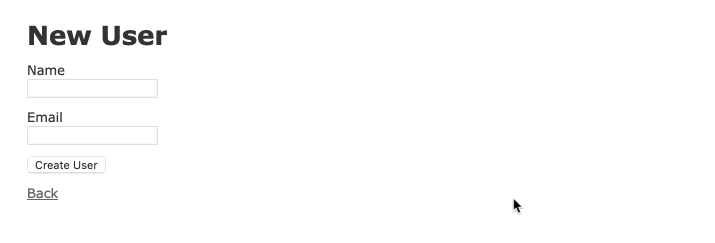

# Micro-Reddit

> This project is to help understand the creation of forms and its control methods to use in Ruby on Rails applications.

This is the third project in the Microverse Rails technical curriculum.

## Built With

- Rails,
- Ruby,
- Form tag helpers

## Intall Ruby on Rails
To install it follow the steps in the [link](https://guides.rubyonrails.org/getting_started.html)

## Setup

Clone the [repository URL](https://github.com/pastorp3/Forms-RoR.git), get into the project root folder and run the migrations for the database
> rails db:migrate

And then start the rails server from the terminal with the command
> rails server

After that go to your browser and put the following addresses in the address bar:

For creating users
> localhost:3000/users/new

For editing users
> localhost:3000/users/:user_id/edit

## Authors

👤 **Mateo mojica**

- Github: [@mateomh](https://github.com/mateomh)
- Twitter: [@mateo_m_h](https://twitter.com/mateo_m_h)
- Linkedin: [Mateo mojica](https://linkedin.com/mateo_mojica_hernandez)

👤 **José Pedraza**

- Github: [@pastorp3](https://github.com/pastorp3)
- Twitter: [@jose_pastor](https://twitter.com/jose_pastorp3 )
- Linkedin: [linkedin](https://www.linkedin.com/in/jos%C3%A9-pedraza-acevedo-ab700a1a9/)

## 🤝 Contributing

Contributions, issues and feature requests are welcome!

Feel free to check the [issues page](issues/).

## Show your support

Give a ⭐️ if you like this project!

## Acknowledgments

- Hat tip to anyone whose code was used
- Inspiration
- Microverse
- Odin Project
- etc

## 📝 License

This project is [MIT](https://opensource.org/licenses/MIT) licensed.